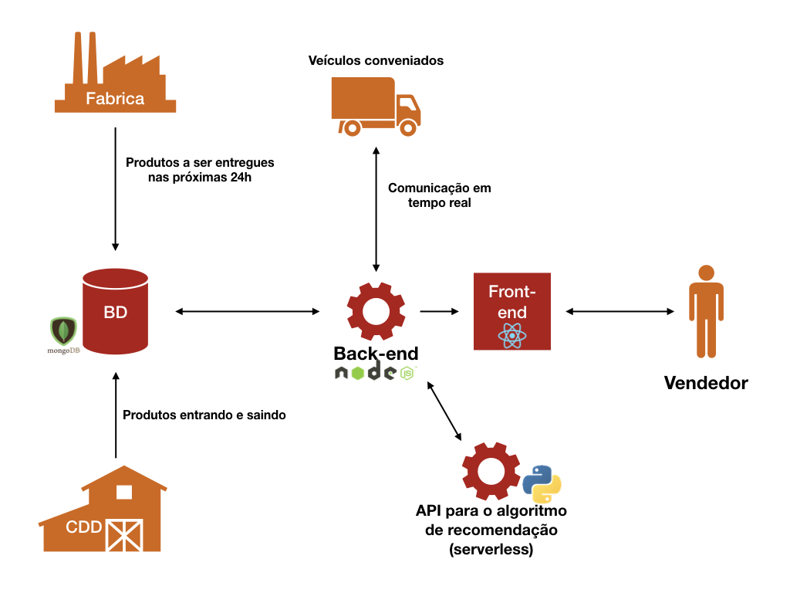

# Desafio Ambev - BRASA Hacks

## Introdução

Essa solução propõe resolver alguns dos problemas de logística encontrados no atual sistema de vendas da Ambev. Se baseando em características como localização, tipo e perfil do estabelecimento, tamanho e nível de desenvolvimento do bairro, estoque do centro de distribuição mais próximo e até tempo esperado de entrega. O aplicativo utiliza um algoritmo que sugere um mix de produtos para o vendedor, facilitando sua venda. E com isso o tempo de entrega e a satisfação do cliente são extremamente otimizados. O app ainda integra CDD com fábrica e transporte, contando com visualização do estoque dos CDDs mais próximos e visualização de entregas futuras das fábricas aos CDDs, além do monitoramento em tempo real de veículos de entrega.

O catálogo de produtos e preços, bem como os locais dos centros de distribuição e fábricas são completamente fictícios, mas garantem a prova de conceito dessa solução.

## Componentes do aplicativo

-   Relatório de acompanhamento do PDV
-   Visualização do estoque dos CDDs mais próximos
-   Visualização de entregas futuras nos CDDs
-   Monitoramento de veículos de transporte com status de entregas na região
-   Recomendação de mix de produtos baseada em caracterísitcas do PDV e do estoque

## Arquitetura do projeto

<div align=center></div>

## Roadmap

-   [x] Monitoramento de estoque de CDDs
-   [x] Monitoramento de futuras entregas de fábricas
-   [x] Uso de características do bairro para recomendação de produtos
-   [x] Uso de características do PDV para recomendação de produtos
-   [ ] Uso de tipo de estabelecimento para recomendação de produtos
-   [ ] Uso de dados de veículos próximos para calcular tempo de entrega
-   [x] Versão web do app
-   [ ] Versão mobile do app

## Instruções para executar localmente

_ATENÇÃO: para executar essa aplicação localmente, você precisará de uma string de conexão ao MongoDB. Se quiser simular um banco com os mesmos dados que utilizei, importe as coleções de `cdds` e `breweries` localizadas [na pasta doc/db](./doc/db). Insira a string de conexão num arquivo com o nome `.env`, na pasta [backend](./backend), da seguinte forma: `MONGODB_URI=<sua-conexão>`._

Tendo [node.js](https://nodejs.org/en/) instalado na sua máquina, clone e acesse o repositório, e execute os seguintes comandos:

Com NPM

```
cd backend
npm run install-deps
npm run build
npm start
```

Com Yarn

```
cd backend
yarn install-yarn
yarn build
yarn start
```

Acesse localhost:5000 no seu navegador para abrir a aplicação.
